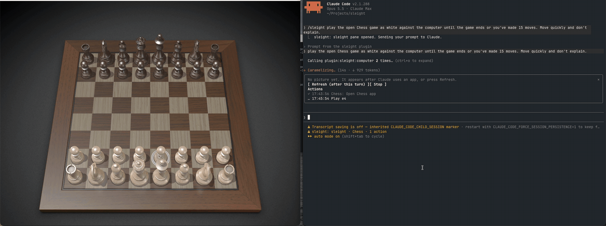

<p align="center"></p>

<h1 align="center">sleight</h1>
<p align="center"><strong>Claude drives your Mac apps in the background. Your cursor stays yours.</strong></p>
<p align="center">A Claude Code plugin that hands Claude the computer-use engine bundled with the ChatGPT desktop app.</p>

<p align="center">
  <a href="https://github.com/Land-o-Clusters/sleight/releases/latest"></a>
  
  
  
</p>

<p align="center">
  <a href="#install">Install</a> ·
  <a href="#why-sleight">Why sleight</a> ·
  <a href="#watch-and-stop-it">Watch and stop it</a> ·
  <a href="docs/settings.md">Settings</a> ·
  <a href="docs/how-it-works.md">How it works</a> ·
  <a href="docs/known-problems.md">Known problems</a> ·
  <a href="docs/benchmark.md">Benchmark</a>
</p>

> [!IMPORTANT]
> sleight is unofficial. OpenAI and Anthropic don't endorse or support it.
> It drives an undocumented runtime that comes with the ChatGPT app, so a ChatGPT update can break it at any time.
> It contains no OpenAI code. It starts the copy already installed on your Mac.

Most computer-use tools borrow your screen. The pointer jumps around, windows pop to the front, and you
sit on your hands until it's done. The engine inside the ChatGPT desktop app sends clicks, drags and
keystrokes straight to the target app instead. The app can be behind your other windows the whole time,
and you keep working. sleight gives that engine to Claude Code.

<p align="center"></p>
<p align="center"><sub>Claude plays macOS Chess against the computer through sleight, at 6× speed. Every move is a drag. The sleight pane on the right logs each one.</sub></p>

## Install

You need macOS on Apple Silicon and the
[ChatGPT desktop app](https://chatgpt.com/download/) with Computer Use turned on in Codex at least
once. That first run installs the engine's helper and gets macOS to grant it Accessibility and Screen
Recording. You can sign out of Codex afterwards. For the Claude Code plugin, use Claude Code 2.1.275
or later.

```bash
claude plugin marketplace add Land-o-Clusters/sleight
```

```bash
claude plugin install sleight@sleight
```

Or, inside a Claude Code session, `/plugin marketplace add Land-o-Clusters/sleight` and then
`/plugin install sleight@sleight`. Start a new session, then check the engine:

```bash
~/.claude/plugins/marketplaces/sleight/plugins/sleight/bin/sleight-mcp --doctor
```

And try it:

```text
Use sleight to open Calculator in the background and work out 12 × 12 by clicking its buttons.
```

The first time Claude touches an app, you get a prompt like *Allow Computer Use to use "Calculator"?*
A yes covers that app for the rest of the session. Apps you marked "Always allow" in Codex or ChatGPT
don't ask, because the engine approves them itself ([settings](docs/settings.md#approval-scope)).

To update, run `claude plugin marketplace update sleight` and `claude plugin update sleight@sleight`,
then start a new session. A running session keeps the version it started with.

Also runs as a plain MCP server: see [other hosts](docs/other-hosts.md).

## Why sleight

- Your Mac stays yours. Clicks, typing and drags go to the app itself, behind your other windows.
  Only a few fallbacks borrow the pointer, and each asks first.
- Several agents can share one Mac. Input leases give one session a window at a time and tell the
  others who holds it. With two sessions typing into one document, text doubled in 5/5 trials
  without leases and appeared once in 5/5 with them.
- It refuses to click a stale element. When a window's element numbers shift, sleight stops actions
  on numbers Claude hasn't seen since, including later clicks in a batch that an earlier click
  renumbered. In the benchmark this caught two clicks that would have hit the menu item next to the
  intended one.
- It's light on context. After each action Claude gets only what changed. On the CNN front page,
  scrolling down five times sent 39,655 characters instead of 203,160.
- It asks once per app per session, except for apps you marked "Always allow" in Codex or ChatGPT,
  which the engine approves itself. A list you write yourself can pre-approve apps. Terminals and
  OpenAI's apps stay off until you opt in, and sleight shows you each terminal command first unless
  you turn that off too.
- The benchmark results are published with their failures. Its tasks in Calculator, TextEdit, Chess
  and an iPhone simulator run three times each, and the 1.1.0 release pass passed 20/21. Every
  pass on the way is published too, including one at 13/21 run while the apps were on another Space,
  and head-to-heads with native Codex computer use, including the Chess one sleight lost 0/3 to 2/3.

sleight also does what the engine can't. It drags text, which the engine's own drag fails to move,
and reaches menu bar icons and notification banners. Each of these needs its own approval.

## Compared with Claude's own computer use

Claude Code has a built-in computer use server, and the Claude desktop app has the same engine.
Anthropic's [documentation](https://code.claude.com/docs/en/computer-use) (read 2026-10-04) says it
controls your screen: other visible apps are hidden while Claude works and come back when the turn
ends. Only one session can use the computer at a time, and it holds the lock until the session exits.
Claude sees the screen through screenshots.

sleight sends events to the app itself, which can be behind your other windows. Your other apps stay
visible, and you keep using the Mac while Claude works. Several sessions can use sleight at once:
we've run two sleight sessions together, and sleight next to Codex. Claude reads each app's
accessibility tree as well as screenshots. Foreground `drag` fallback, `hover` and some `menu_bar`
actions briefly take the pointer.

Claude's own computer use is supported by Anthropic and also runs on Windows in the desktop app.
sleight is unofficial and depends on the ChatGPT app's engine.

## Watch and stop it

The apps sleight drives stay in the background, which also means you can't see them. On Claude Code
v2.1.287 or later you get three ways to keep an eye on things.

`/sleight` opens a pane with the app's latest picture and a log of every action Claude took. Anything
after it goes to Claude as a prompt, so `/sleight play chess in the background` opens the pane and starts
the task. The picture refreshes after each turn that used sleight, or when you press Refresh (`r`) while
Claude is idle. A terminal draws it in colored half-blocks. The desktop app's Code tab shows the
screenshot itself.

The status line shows which app Claude is working in and how many actions it has taken.

`/sleight stop`, or Stop (`s`) in the pane, works mid-turn. It ends the engine's turn and refuses every
further sleight call until your next message. Press Esc too if you want the rest of Claude's turn gone.

The pane waits for Claude to finish before it takes a picture. The engine reports UI changes as a diff
against the latest read of an app, no matter who made that read, so a snapshot mid-turn could hide a
change from Claude. When the pane does read an app, your next message tells Claude to take a full read
before relying on a diff.

## Replay a run

A run Claude finished can run again with no model, through the same guards:

```bash
~/.claude/plugins/marketplaces/sleight/plugins/sleight/bin/sleight-mcp record <session id> task.json
```

```bash
~/.claude/plugins/marketplaces/sleight/plugins/sleight/bin/sleight-mcp replay task.json
```

The session id is the transcript's file name under `~/.claude/projects`. Replay stops at the first
step the app isn't ready for, and asks in the terminal before using an app you haven't pre-approved.
[How it works](docs/design/replay.md).

## Safety

- `js` runs JavaScript as you, so treat it like Bash. Claude Code asks before each call unless you allow
  `mcp__plugin_sleight_computer__js`, and allowing it means Claude can send any code without asking.
- Per-app approvals apply however you've set up the `js` tool. An accepted approval lasts for the
  session ([approval scope](docs/settings.md#approval-scope)).
- Foreground `drag` fallback, `hover` and the `menu_bar` fallback for SwiftUI icons move your pointer
  briefly, and each waits until you've stopped typing and using the mouse for 2 s. `drag` moves text
  in an app's text field or a TextEdit window you've covered through Accessibility first, without
  the pointer. `drag` refuses points outside
  the chosen window's visible content; foreground also refuses covered endpoints, after bringing the
  app forward.
  `hover` refuses points another window covers, including
  another window of the same app, and takes about two seconds with the default dwell.
- The repo is small enough to read before you install it. It holds a launcher, a relay, a mod, a skill,
  two manifests and the macOS scripts for the approval panel, menu bar tools, drag and hover.

## Troubleshooting

| Symptom | Likely cause | Fix |
|---|---|---|
| `no Codex computer-use plugin at …` | Computer Use never enabled in ChatGPT | Open ChatGPT → Codex, turn on Computer Use, and run one task |
| `--doctor` shows `MISSING computer-use helper` | The helper app was removed or never installed | Same as above |
| Repeated `timeoutReached` | An app or the helper stopped answering reads | Stop retries. sleight checks native Accessibility and a fresh read of another previously acquired app. Follow the resulting app advice; if evidence is incomplete, report that uncertainty |
| The helper diagnosis reports two responsive AX apps and a timed-out control read | The engine's read path appears stuck | Tell the user. Only they should restart ChatGPT, which ends Codex sessions. Doctor's inventory result alone cannot distinguish an app hang |
| Approval prompt never appears | Claude Code too old for form elicitation | Update Claude Code |
| "Not approved" right away in the desktop app, with no panel | The session started before sleight 0.1.1 | Start a new session |
| A desktop session still shows as busy after Claude has finished | Before 0.3.1, nothing ended the engine's turn in the desktop app | Update sleight and start a new session |
| "Sky Computer Use service startup request failed" | macOS kept the helper's old launchd job and won't start a new one | Run `--doctor`; it prints the `launchctl remove` command that clears the job without restarting ChatGPT |
| Tool calls fail after a ChatGPT update | Runtime API changed | Open an issue with the `--doctor` output |

More in [Known problems](docs/known-problems.md).

## Development

```bash
npm test               # relay unit tests
npm run validate       # claude plugin validate, marketplace and plugin
npm run test:mod       # the mod's tests, against the engine (claude plugin test)
npm run typecheck      # needs the types Claude Code writes when it loads the mod
npm run lint:prose     # Vale with the ai-tells style pack, over the docs
SLEIGHT_TRACE=1 claude --plugin-dir plugins/sleight   # logs every relayed message to ~/Library/Logs/sleight/
```

### Update watch

`scripts/watch.sh` runs `--doctor` and saves the engine's runtime API docs to
`~/Library/Logs/sleight/engine-api-<version>.md`. The capture calls `getApp` with a bundle ID that
doesn't exist, so it doesn't touch an app or prompt for approval.
When the version changes, it writes `engine-api-<version>.diff` against the previous snapshot and runs
one benchmark task, with the diff path in the macOS notification (the first run saves a baseline).
It logs to `~/Library/Logs/sleight/watch.log` and also notifies when a check fails; an older watch
without a previous snapshot reports that the diff is unavailable.

```bash
npm run watch            # check now
npm run watch:install    # run it every Monday at 9:00 (a launchd job)
npm run watch:remove     # remove the job
```

The benchmark task auto-approves Calculator, like any benchmark run.

## Roadmap

The full plan, in order, is in [docs/status/ROADMAP.md](docs/status/ROADMAP.md). Features, done and
open:

- [x] MCP server that survives ChatGPT updates
- [x] Session and turn ids, so the engine can scope approvals and cleanup
- [x] Approvals that last for the session, as in Codex
- [x] Hide or block the engine's internal tools for Claude
- [x] A skill that tells Claude when to use sleight and when to fall back to a pointer-moving tool,
  delivered with the engine's first result so it costs no turn
- [x] Per-turn cleanup through the mod's `turn.complete` hook
- [x] Live pane with the app's latest picture and an action log
- [x] Status line entry and `/sleight stop`
- [x] Hover workarounds in the skill
- [x] A reproducible task benchmark
- [x] Weekly update watch
- [x] Approvals in the desktop app's Code tab, through sleight's own panel
- [x] Menu bar icons and notification banners, which the engine leaves out
- [x] A fair benchmark against LCU, with each arm checked to load only its own tool
- [x] Text drags: a drag of sleight's own that holds the mouse down and moves in steps
- [x] TextEdit drags in the background, with verified text readback and foreground fallback
- [x] The pane and status line in the desktop app's Code tab
- [ ] `/sleight stop` checked in the desktop app's Code tab
- [ ] Windows. Codex computer use reached Windows on 2026-05-29 (foreground only); a port is unchecked
- [x] Approve one document instead of a whole app (`SLEIGHT_APPROVAL_SCOPE=document`, a guard against
  mistakes rather than a security boundary)
- [x] Review saved-file changes and choose Keep or Undo through a user prompt
- [ ] Review unsaved changes and app state without backing files
- [x] Rules for what data may move from one app to another (`SLEIGHT_FLOW_RULES=1`, a guard against
  mistakes rather than a security boundary)

## Credits

- [@argofowl](https://x.com/argofowl) showed that the ChatGPT app's computer-use server works outside Codex.
- [LCU](https://github.com/amontlabs/lcu), started by 0xpolarzero, takes the same idea across several harnesses, and its notes mapped out how the runtime's lifecycle works.
- The icon started as an image from ChatGPT's image generation.

## License

[MIT](LICENSE). The ChatGPT app and its computer-use runtime belong to OpenAI, under OpenAI's terms.
sleight doesn't include or redistribute either.
