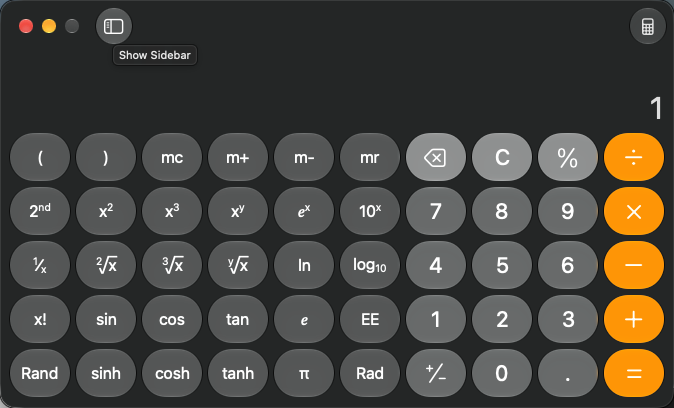

# Local hover trials, 2026-10-04

The review corrections are implemented. Tell the user about the brief pointer takeover, and require an exact unique title when several windows are on screen. Unit tests exercise two windows and refusal before activation.

The owner confirmed they were away for both batches. Every app-driving attempt used the shared live lock and benchmark approvals for Calculator, TextEdit or Chess. Every attempt that acquired the lock released it. The full textual transcripts and available PNGs are linked below. Home paths are written as `~`. TextEdit's Save sheet belonged to another session and was left alone. ChatGPT was never quit or restarted.

The first batch did not establish a tooltip or hover-menu delay. Calculator's Mode button has only an icon in its screenshot. Its Help text was available in the background. The Chess trials targeted the close-button tooltip and green-button hover menu. Covered points refused before takeover.

Calculator hovered for 400, 1000 and 1500 ms in one attempt. Its measured takeovers were 554, 1156 and 1659 ms, but capture failed with `-[NSNull count]`, so those times do not prove when a tooltip appeared. Capture now passes an empty NSDictionary rather than null, with a regression test. The later trials were covered or failed the setup foreground check. The later batch verified the corrected capture.

Activation options were tried in setup and temporarily in hover. They did not provide reliable foreground behavior. Production retains the reviewed activation and restoration calls. The test fixture records the actual front PID and stops failed activation before hover.

Fixture checks reported a pointer mismatch after restoration, even though the warp returned success. Its cause is unresolved. A sandbox-denied attempt returned an invalid checkpoint and could not verify restoration. These attempts count as failures. The first discovery and delay attempts predate fixture restoration checks. The final Chess trial verified the fixture's pointer and front-app restoration.

| Attempt | Exit | Hover steps | Result |
| --- | ---: | ---: | --- |
| [chess-discovery-1](2026-10-04-hover-chess-discovery-1/results.json) | 0 | 0 | Chess was read with six normal windows on screen. |
| [chess-hover-1](2026-10-04-hover-chess-hover-1/results.json) | 1 | 2 | Exact title selected. Tooltip and green-button menu points covered. |
| [chess-titles-1](2026-10-04-hover-chess-titles-1/results.json) | 1 | 0 | App inventory omitted titles. Pointer verification differed. |
| [chess-window-1](2026-10-04-hover-chess-window-1/results.json) | 1 | 0 | Engine does not accept macOS windowId selection. |
| [discovery-1](2026-10-04-hover-discovery-1/results.json) | 1 | 0 | Engine sandbox denial. |
| [discovery-2](2026-10-04-hover-discovery-2/results.json) | 0 | 0 | Calculator and TextEdit reads. Save sheet left alone. |
| [menu-discovery-1](2026-10-04-hover-menu-discovery-1/results.json) | 1 | 0 | Mode click did not expose a menu. ESC key name unsupported. |
| [raised-active-1](2026-10-04-hover-raised-active-1/results.json) | 1 | 0 | Engine sandbox denial. Checkpoint invalid before app input. |
| [raised-active-2](2026-10-04-hover-raised-active-2/results.json) | 1 | 0 | Raise plus activation did not make Calculator front. |
| [tooltip-active-1](2026-10-04-hover-tooltip-active-1/results.json) | 1 | 3 | Setup app lookup failed. Three refusals. |
| [tooltip-active-2](2026-10-04-hover-tooltip-active-2/results.json) | 1 | 3 | Setup activation failed. Three refusals. |
| [tooltip-active-3](2026-10-04-hover-tooltip-active-3/results.json) | 1 | 3 | Setup lookup corrected. Three covered-point refusals. |
| [tooltip-active-4](2026-10-04-hover-tooltip-active-4/results.json) | 1 | 3 | Capture failed with NSNull count after each dwell. |
| [tooltip-active-5](2026-10-04-hover-tooltip-active-5/results.json) | 1 | 3 | Capture corrected but target covered. Pointer verification differed. |
| [tooltip-active-6](2026-10-04-hover-tooltip-active-6/results.json) | 1 | 0 | Verified setup stopped because Calculator was not front. |
| [tooltip-delay-1](2026-10-04-hover-tooltip-delay-1/results.json) | 1 | 1 | Engine sandbox denial. |
| [tooltip-delay-2](2026-10-04-hover-tooltip-delay-2/results.json) | 1 | 3 | Three covered-point refusals. |
| [tooltip-diagnose-1](2026-10-04-hover-tooltip-diagnose-1/results.json) | 1 | 1 | Cover identified as ChatGPT. Zero takeover. |
| [tooltip-raised-1](2026-10-04-hover-tooltip-raised-1/results.json) | 1 | 3 | Raise did not uncover the target. Three refusals. |

The retained PNGs show Calculator. The original inspection missed identifying text in Chess and TextEdit images. Both privacy rejections are recorded below.

## Second away window

The owner said they were stepping away again. The fixture now saves and restores one uniquely titled Calculator or Chess window, raises it and verifies its position. It runs only after that app passes benchmark approval, under the shared lock. The first placement crossed a display boundary for Chess. The final fixture requires the window to fit wholly on the main display.

| Attempt | Exit | Result |
| --- | ---: | --- |
| [arranged-1](2026-10-04-hover-arranged-1/results.json) | 1 | Cancelled through the owned terminal while waiting for another run's lock. It stopped before lock acquisition and app input. |
| [arranged-2](2026-10-04-hover-arranged-2/results.json) | 0 | Calculator Mode tooltip absent at 400 ms, partly visible at 1500 ms. Takeovers 696 and 1789 ms. |
| [sidebar-delay-1](2026-10-04-hover-sidebar-delay-1/results.json) | 0 | Sidebar tooltip absent at 400 and 1000 ms, fully readable at 1500 ms. Takeovers 691, 1293 and 1786 ms. |
| [chess-arranged-1](2026-10-04-hover-chess-arranged-1/results.json) | 1 | PNG response exceeded the 1 MiB stdout buffer at both dwells. Global fixture restoration verified. |
| [chess-arranged-2](2026-10-04-hover-chess-arranged-2/results.json) | 0 | Menu visible at 400 and 1500 ms, but privacy review rejected both PNGs because another app was visible across the display boundary. Hashes retained, PNGs withheld. |
| [chess-arranged-3](2026-10-04-hover-chess-arranged-3/results.json) | 0 | Window wholly inside one display. Menu visible at 400 and 1500 ms, with takeovers of 693 and 1798 ms. Later review found the account name in both PNGs. Both removed. |

The sidebar observations support the 1500 ms default: 0/1 visible at 400 ms, 0/1 at 1000 ms and 1/1 at 1500 ms. They bracket the required dwell between the tested 1000 and 1500 ms settings on this Mac. The captures give a dwell interval. An exact tooltip onset time remains unmeasured. The final Chess trial showed the hover menu in 1/1 capture at 400 ms and 1/1 at 1500 ms. Capture itself adds time after the dwell.

The failed large response reproduced in a unit test before correction. Hover now has a bounded 16 MiB output buffer. A 2 MiB response passes, and 17 MiB still refuses. The test collects that oversized child. The other native tools retain their default buffer.

All completed runs in this batch verified the fixture's restoration of the original window position, pointer and front app, and released the lock. Hover's own pointer and front-app restoration was not measured before the fixture restored them. That gap remains in Known problems. The cancelled waiter did not own the lock. Earlier pointer mismatches remain unresolved and are retained above. Screen-rectangle capture can include unrelated app content outside the hovered point, especially across display boundaries. That limitation remains in Known problems. Rejected cross-display PNGs remain locally in the ignored `bench/results/hover-private-chess-arranged-2/` folder with SHA-256 hashes in the public result file.

Round 2 privacy review found identifying Chess titles in JSON and three PNGs, plus a TextEdit home-folder label in JSON and one PNG. Text and plans now use placeholders. Those four PNGs were removed. The branch history was rewritten to omit the original evidence commits. Every attempt and its exit code remains published. Future hover trials redact text before publication and omit Chess and TextEdit images with hashes. Historical Chess plans need a current window title before reuse.
